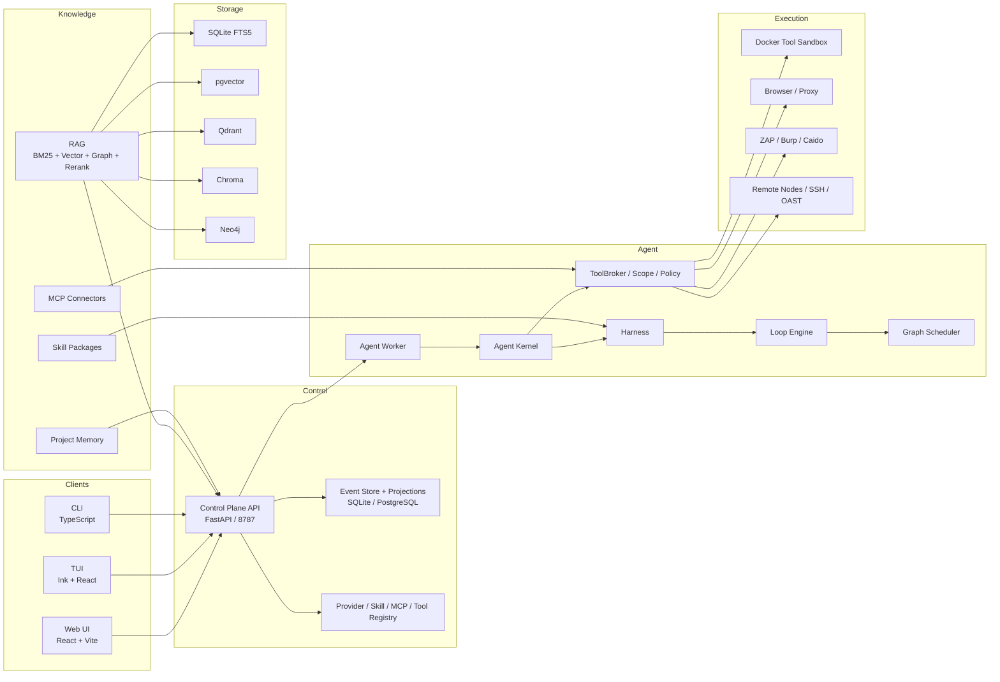

# Veridix

> 文档状态：发布版草案。内容基于当前开发基线的真实架构、组件与命令整理，后续随正式发布版本同步更新。

Veridix 是一套面向授权安全测试与漏洞验证的 AI Agent 平台。它把侦察、扫描、验证、利用复现、证据归档和报告生成组织成可审计的 Agent 工程流水线，提供 Web、TUI、CLI 三种一致的操作入口，并集成真实安全工具链、知识库、项目记忆、MCP、技能包与多角色图编排。

## 核心定位

- **不是聊天玩具**：每次 Run 都有完整状态机、事件流、Checkpoint、证据和可复现轨迹。
- **不是工具拼盘**：nmap、nuclei、sqlmap、Metasploit、ZAP 等工具统一进入 ToolBroker、沙箱和证据链，由 Agent 按任务意图编排。
- **不是黑盒调用**：Harness、Loop、Graph 都暴露结构化的状态、指标、预算、人工门禁和失败原因。
- **适合护网、授权渗透测试、代码审计、资产盘点与复测**：面向有明确授权边界的真实测试场景。

## 快速开始

### 前置要求

- Node.js `>=22`
- Python `3.11+`
- Docker Desktop / Docker Engine
- 一个 OpenAI-compatible 或 LiteLLM 兼容的模型端点（本地或云端）
- 需要真实工具链时，使用 `deploy/system/docker-compose.yml` 启动存储与工具环境

### 首次安装

```bash
npm ci
python -m pip install -r services/requirements.txt
```

### 一键启动完整开发环境

```bash
npm run up
```

该命令会：

1. 启动统一 Compose 栈：pgvector、Qdrant、Chroma、Neo4j、`veridix-tools` 工具环境、ZAP DAST；
2. 启动 Lab Provider、Control Plane、Agent Worker 和 Web；
3. 等待所有健康检查通过。

启动后：

- Web: <http://127.0.0.1:5173>
- Control Plane API: <http://127.0.0.1:8787>
- Lab Provider: <http://127.0.0.1:8766>

停止：

```bash
npm run down
```

## 三端入口

### Web

启动 Web 后访问 `http://127.0.0.1:5173`。主要页面包括：

- 任务中心、新建任务、运行控制台、会话
- 证据与发现、漏洞与风险、资产与组件
- 知识库、项目记忆、报告
- 诊断与设置、验收

### TUI

```bash
npm run dev -w @veridix/tui
```

进入后使用 `/help` 查看斜杠命令，例如：

```text
/providers /provider-add /provider-test
/skills /skill-add /skill-delete
/mcp /mcp-add /mcp-test
/knowledge /knowledge-add /knowledge-delete
/memory /memory-record /memory-fix /memory-clear
/assets-list /asset-add /report /vulns /health
```

### CLI

```bash
npm run dev -w @veridix/cli -- --help
```

常用命令：

```bash
veridix provider register deepseek --endpoint https://api.deepseek.com --model deepseek-v4-flash --api-key-ref env:DEEPSEEK_API_KEY
veridix project lab
veridix target <project-id> --url https://target.example
veridix mission <project-id> web
veridix run start <mission-id>
veridix run attach <run-id>
veridix report <run-id> --format bundle --out .
```

## 系统概览



## 界面预览

> 发布版 README 将在此处补充 Web 任务中心、运行控制台、证据/攻击图、诊断配置页，以及 TUI 运行视图和 CLI 命令输出的实机截图。

## 文档

- [系统说明](docs/system-specification.md)：面向外部介绍的产品与设计说明，重点讲系统能力、先进设计与使用价值
- [技术白皮书](docs/whitepaper.md)：从数据契约到算法实现的完整工程手册，覆盖 Harness/Loop/Graph、RAG、记忆、技能、MCP、工具注册表、证据链与扩展方式
- [用户使用手册](docs/user-guide.md)：安装部署、三端操作、资源配置、故障排查

## 安全边界

- 只允许测试授权范围内的目标，ToolBroker 对越界请求直接拒绝。
- Control Plane 是唯一事务写入者，UI/TUI/CLI 不持有权威状态。
- API Key 只通过 `env:NAME` 或受控 SecretRef 引用，不写入仓库。
- 高风险工具调用、人工门禁、证据门禁均结构化记录。
- 请勿对未授权目标使用本工具。

## 许可证

- Veridix 核心代码使用 MIT License。
- Strix 和 CyberStrikeAI 来源内容为 Apache-2.0，使用和署名要求见
  [THIRD_PARTY_NOTICES.md](THIRD_PARTY_NOTICES.md)。
- CyberStrikeus/CyberStrike 为 AGPL-3.0，其衍生内容不包含在本发布仓库中。
