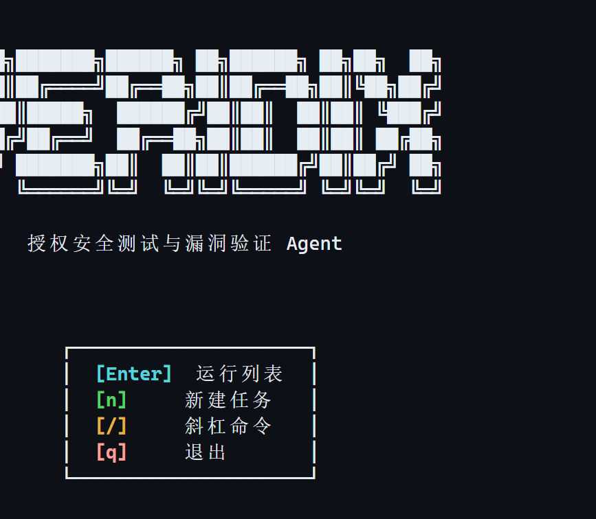
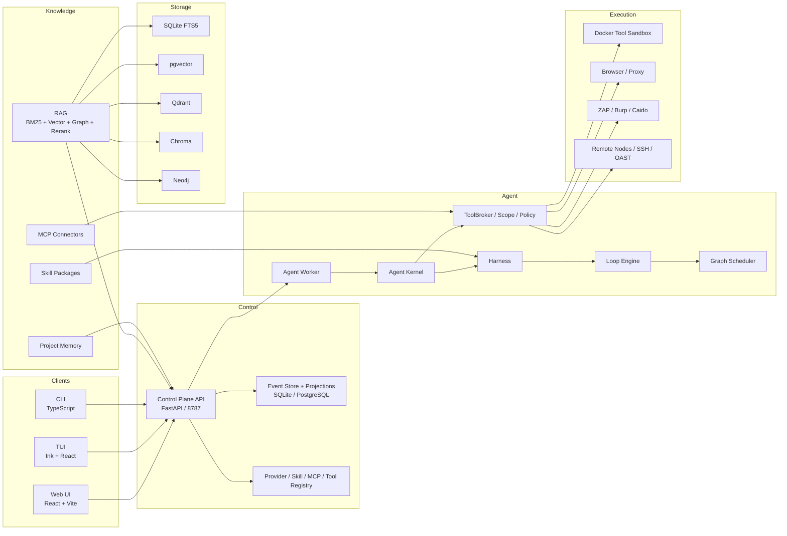
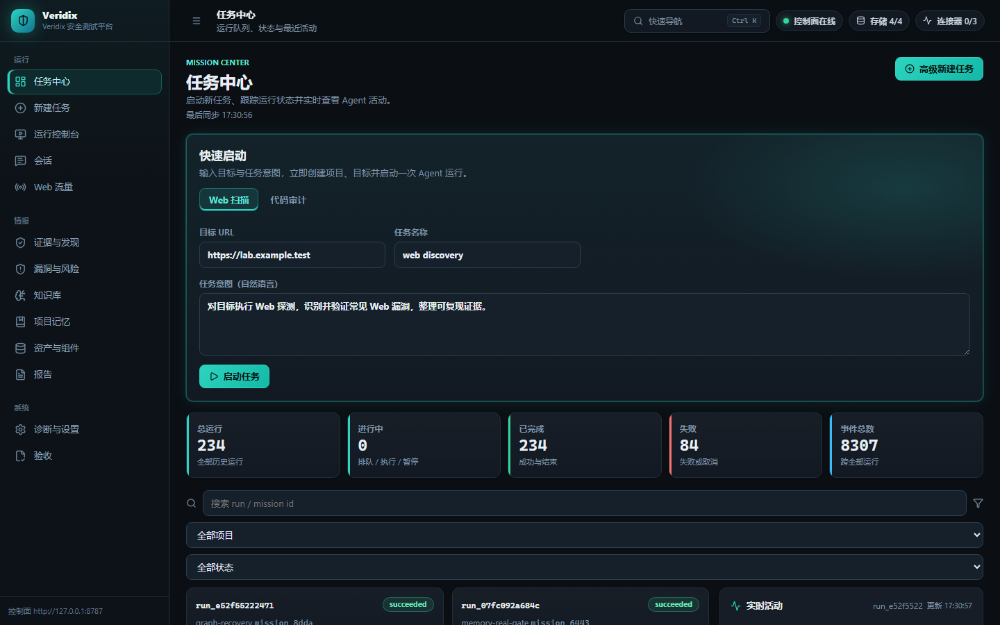

# Veridix

Veridix 是一个面向授权安全测试与漏洞验证的 AI Agent 平台。它把侦察、扫描、验证、利用复现、证据归档和报告生成组织成可审计的 Agent 工程流水线，提供 Web、TUI、CLI 三种一致的操作入口。



## 功能

- Harness / Loop / Graph 三层 Agent 工程，支持多角色、多 Agent 图编排
- 内置 ATT&CK、OWASP、CWE、漏洞利用方法论、渗透技能包和项目记忆
- 多路检索：BM25、向量、知识图谱、Rerank 和 RRF 融合
- 真实工具链：nmap、nuclei、fscan、sqlmap、Metasploit、ZAP、Burp、Caido 等
- 证据链：Finding 必须经过 Oracle、证据门禁和人工审批才能进入报告
- Web / TUI / CLI 三端一致，支持 Provider、MCP、Skills、知识库和存储管理
- 授权边界、RBAC、审计日志、远程节点、SSH 和 OAST 支撑真实测试场景

## 快速开始

### 环境要求

- Node.js `>=22`
- Python `3.11+`
- Docker Desktop 或 Docker Engine
- 一个 OpenAI-compatible 或 LiteLLM 兼容的模型端点

### 安装完整产品

Veridix 通过 GitHub 仓库安装，运行环境由 Docker Compose 自动提供。安装后启动完整产品：

```bash
git clone git@github.com:kxahcc/veridix.git
cd veridix
npm ci
npm run build
npm run up
```

`npm run up` 会：

1. 拉取并启动 pgvector、Qdrant、Chroma、Neo4j 和 `veridix-tools` 工具环境；
2. 启动 Control Plane、Agent Worker 和 Web；
3. 等待全部健康检查通过。

停止：

```bash
npm run down
```

启动后访问：

- Web: <http://127.0.0.1:5173>
- Control Plane API: <http://127.0.0.1:8787>
- Lab Provider: <http://127.0.0.1:8766>

CLI 使用 `npm run cli -- <命令>` 调用，TUI 使用 `npm run tui` 启动。
存储和工具环境由 Docker Compose 统一管理，不需要手动逐个拉镜像。

## Docker 镜像

工具环境默认使用 GitHub Container Registry：

```text
ghcr.io/kxahcc/veridix/veridix-tools:full
ghcr.io/kxahcc/veridix/veridix-tools:code-lite
```

存储后端使用 pgvector、Qdrant、Chroma、Neo4j 官方镜像，由 Compose 自动拉取。

## 三端入口

### Web

访问 `http://127.0.0.1:5173`，使用任务中心、运行控制台、证据与发现、漏洞与风险、知识库、项目记忆、报告、诊断与设置。

### TUI

```bash
npm run tui
```

进入后使用 `/help` 查看斜杠命令，例如：

```text
/providers /provider-add /provider-test
/skills /skill-add /skill-delete
/mcp /mcp-add /mcp-test
/knowledge /knowledge-add /knowledge-delete
/memory /memory-record /memory-fix /memory-clear
/assets-list /asset-add /report /vulns /health
```

### CLI

```bash
npm run cli -- provider register deepseek \
  --endpoint https://api.deepseek.com/v1 \
  --model deepseek-v4-flash \
  --api-key-ref env:DEEPSEEK_API_KEY

npm run cli -- project lab
npm run cli -- target <project-id> --url https://target.example
npm run cli -- mission <project-id> web
npm run cli -- run start <mission-id>
npm run cli -- run attach <run-id>
npm run cli -- report <run-id> --format bundle --out .
```

## 系统概览



## 界面预览



更多截图：

- [Web 运行控制台](screenshots/web-run-cockpit.png)
- [证据与发现](screenshots/web-evidence.png)
- [攻击图](screenshots/web-attack-graph.png)
- [诊断与设置](screenshots/web-settings.png)
- [CLI 帮助](screenshots/cli-help.png)

## 文档

- [系统说明](docs/system-specification.md)
- [技术白皮书](docs/whitepaper.md)
- [用户使用手册](docs/user-guide.md)

## 安全边界

- 只允许测试授权范围内的目标，ToolBroker 对越界请求直接拒绝。
- Control Plane 是唯一事务写入者，UI/TUI/CLI 不持有权威状态。
- API Key 只通过 `env:NAME` 或受控 SecretRef 引用，不写入仓库。
- 高风险工具调用、人工门禁、证据门禁均结构化记录。
- 请勿对未授权目标使用本工具。

## 许可证

- Veridix 核心代码使用 MIT License。
- Strix 和 CyberStrikeAI 来源内容为 Apache-2.0，使用和署名要求见 [THIRD_PARTY_NOTICES.md](THIRD_PARTY_NOTICES.md)。
- CyberStrikeus/CyberStrike 为 AGPL-3.0，其衍生内容不包含在本发布仓库中。
